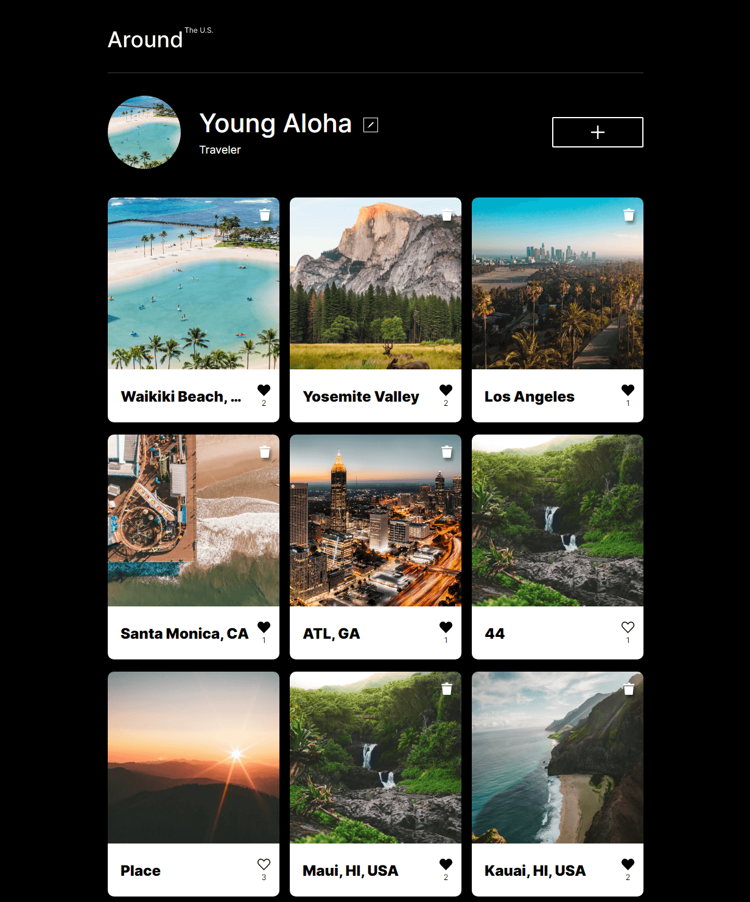
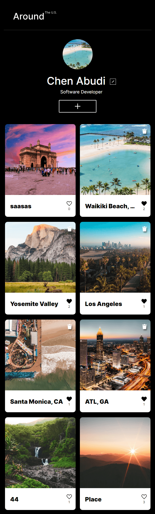
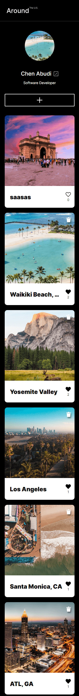

# Project 10 : Around the U.S (React.js)

This project was bootstrapped with [Create React App](https://github.com/facebook/create-react-app).

# Overview:

- Intro
- Languages & Techniques
- Images
- Possible Improvements
- Deployed Project

## Intro

This is the 10th project at Practicum by Yandex. It's an adaptively interactive application which showcases a person's travel around the U.S.
It was built mainly with ReactJS and uses REST API. It's ReactJS version of
[Around the U.S](https://github.com/Chen-Abudi/web_project_4). All elements are designed to be displayed correctly on the popular screen sizes (1280px, 320px) and between them.

## Languages & Techniques

- HTML5, CSS3
- Javascript
- ReactJS
- Grid, flex, forms, animation
- Adaptive layout
- Flat BEM file structure
- OOP
- Webpack, babel, postcss
- DOM manipulation
- REST API requests

## Images

- [For more incredible images, feel free to Click Here !](https://unsplash.com/)

## Possible Improvements

- Optimize the website for Disabled Users.
- Optimize the page speed and adding security.
- Additional animations.
- Option to select postcards group to remove together.
- Using Backend to store the forms contact changes.
- User Registration.

## Deployed Project

Link to the project on GitHub pages : [Around the U.S ReactJS](https://chen-abudi.github.io/around-react/)

#### Overview

#### 620px - 916px Resolution

#### 320px Resolution

https://user-images.githubusercontent.com/98914366/180032748-7895135e-cdae-4537-8402-2189bafeee4b.mp4

